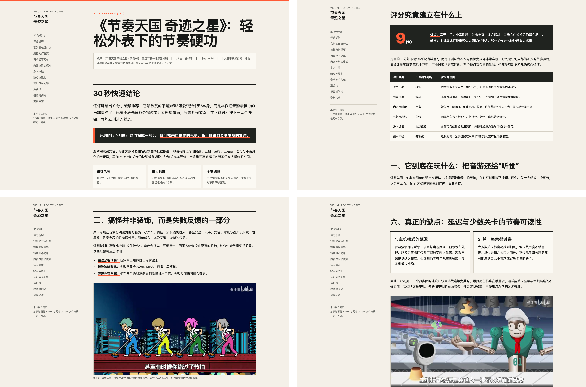
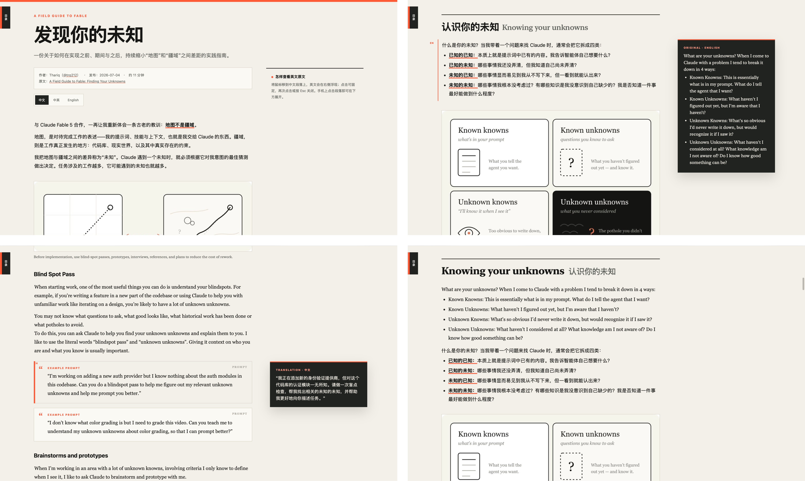

# Layout Design Systems｜排版设计系统

一个可持续扩展的个人 Codex Skill，用于把已经完成内容编辑的材料制作成具有稳定阅读节奏、明确语义层级和完整响应式体验的视觉成品。

当前包含两套经过真实项目验证的长文系统：面向单语内容的 **Editorial Longform**，以及面向英文原文与中文译文对照阅读的 **Editorial Bilingual Longform**。

## 当前设计系统

| 设计系统 | 适用场景 | 输出形式 |
|---|---|---|
| Editorial Longform | 单语长文、课程笔记、内容总结、方法论和知识文档 | 可独立打开的 HTML 长文 |
| Editorial Bilingual Longform | 支持英文长文的中文阅读、中英混排与英文原文阅读三种排版模式 | 具备三种语言模式的独立 HTML 长文 |

## 01 · Editorial Longform



面向单语长篇阅读的编辑式网页设计系统。它使用暖灰纸张背景、近黑正文、珊瑚橙强调色、18px 正文、宽松行高和克制的高对比组件，在连续阅读中建立清晰节奏。

- 适用于：课程笔记、内容总结、深度文章、方法论和知识文档
- 视觉特征：编辑式排版、章节留白、重点色块、解释性图片、表格与行动型文本卡片
- 设计规范：[editorial-longform-design.md](design-systems/editorial-longform-design.md)
- 网页模板：[editorial-longform-template.html](assets/editorial-longform-template.html)

## 02 · Editorial Bilingual Longform



继承 Editorial Longform 的颜色、正文基准、组件骨架、图片、打印与无障碍规则，并增加三种语言模式、语义配对、中英字体分工、对照栏和双语组件规则。

这套系统支持三种阅读路径：中文模式以中文为主并按需核对英文原文，中英混排模式按照英文在上、中文在下连续阅读，英文模式则以英文为主并按需查看中文译文。

- 适用于：已有完整英文原文、需要忠实中文翻译与原文核对的长文章
- 视觉特征：中文无衬线、英文衬线；中英正文同为 18px；中英间距 10px、语义组间距 30px
- 设计规范：[editorial-bilingual-longform-design.md](design-systems/editorial-bilingual-longform-design.md)
- 网页模板：[editorial-bilingual-longform-template.html](assets/editorial-bilingual-longform-template.html)
- 内容准备边界：[english-source-to-bilingual-html.md](references/english-source-to-bilingual-html.md)

## 内容输入边界

这个 Skill 的主体是排版，不把转写、研究或内容创作混入视觉系统。

### 直接提供英文文章

英文文章直接进入排版。保留原文的结构、观点和表达，不进行实质改写；如需双语版本，只完成忠实翻译、语义配对和必要的结构映射。

### 提供音频、视频或逐字稿

音频、视频或逐字稿只是上游素材。应先获取并理解完整内容，去除口语重复与碎片表达，在不补充外部事实的前提下，先重构为文章；只有文章内容准备完成后，才进入本 Skill 排版。

逐字稿本身不是最终展示内容。页面默认不嵌入播放器，也不承担时间轴、逐段跳转或实时字幕同步；只有用户明确要求边听边读时，才把播放器作为独立扩展。

## 使用方法

让 Skill 根据目的、阅读对象、内容形态和输出媒介推荐设计系统：

```text
请使用 $layout-design-systems，为我已经整理好的内容推荐并应用合适的排版设计系统。
```

直接指定单语长文系统：

```text
请使用 $layout-design-systems 中的 Editorial Longform，把这份已经完成的中文内容制作成适合深度阅读的独立网页。
```

直接指定双语长文系统：

```text
请使用 $layout-design-systems 中的 Editorial Bilingual Longform，把这篇英文文章制作成支持中文、中英混排和英文三种模式的独立 HTML。
```

如果输入来自播客或视频，应先完成文章重构，再提出排版请求。

## 安装

将仓库克隆到个人 Codex Skills 目录：

```bash
git clone https://github.com/liusenjun/layout-design-systems.git ~/.codex/skills/layout-design-systems
```

如果该目录已经存在，请先克隆到其他位置，再有选择地同步文件，避免覆盖尚未保存的本地修改。

## 目录结构

```text
layout-design-systems/
├── README.md
├── SKILL.md
├── agents/
│   └── openai.yaml
├── design-systems/
│   ├── design-system-catalog.md
│   ├── editorial-longform-design.md
│   └── editorial-bilingual-longform-design.md
├── references/
│   └── english-source-to-bilingual-html.md
├── assets/
│   ├── editorial-longform-template.html
│   └── editorial-bilingual-longform-template.html
└── docs/
    └── previews/
        ├── editorial-longform-preview.png
        └── editorial-bilingual-longform-fable-preview.png
```

- `SKILL.md`：设计系统选择、加载、执行与验证流程；这是 Codex 的主要入口。
- `design-systems/`：每套正式设计系统的完整视觉与交互规范。
- `references/`：只有在对应内容路径中才需要加载的工作流说明。
- `assets/`：生成视觉成品时复制和改写的 HTML 模板。
- `docs/previews/`：用于 GitHub README 与项目展示，不参与 Skill 运行。

README 面向使用者说明仓库能力；实际执行约束以 `SKILL.md`、Design MD 和对应模板为准。

## 扩展原则

新的设计系统只有经过真实项目验证后，才会登记为正式可用。具体文章标题、作者、段落数、图片数或某个项目的固定内容不得写成通用模板规则。
